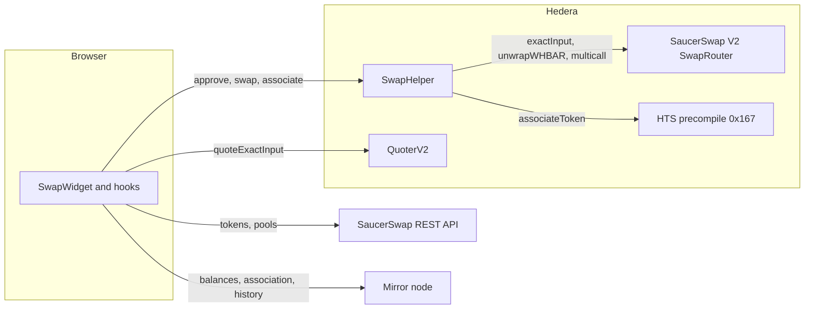
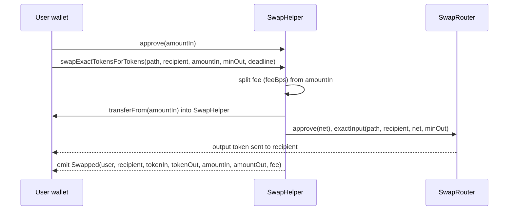
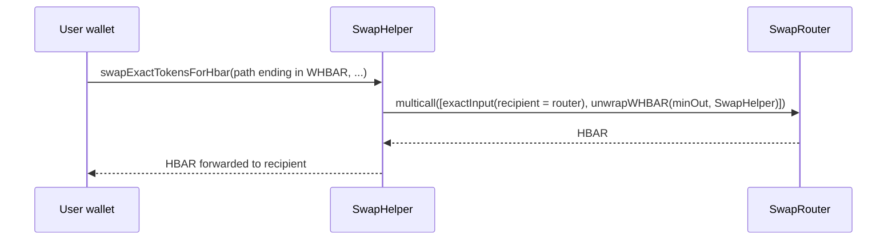
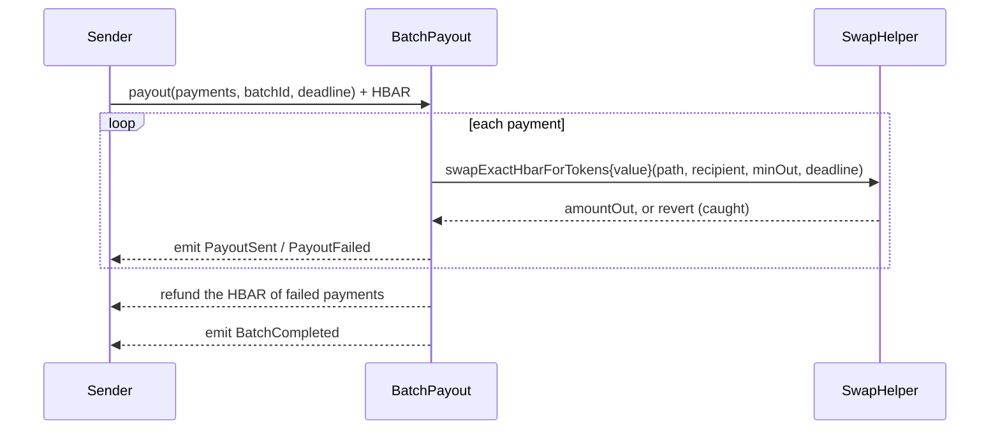
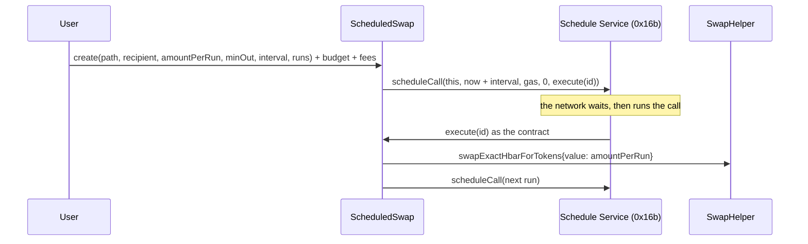
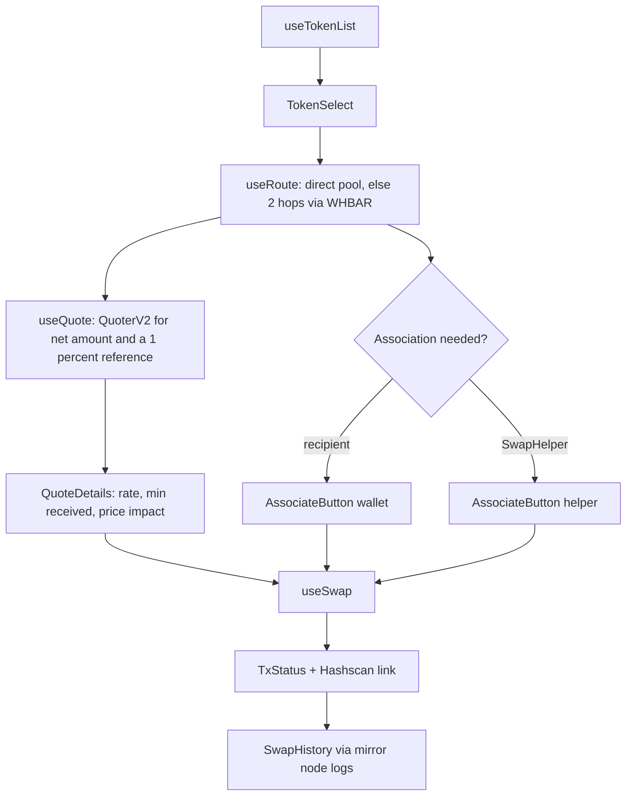

# Architecture

## Overview

The browser reads **market data** from SaucerSwap's REST API, **account state** from the mirror node, and **prices** from the on-chain QuoterV2. It sends **transactions** only to `SwapHelper`, which calls the router.

## The contract: `SwapHelper`

`SwapHelper` holds no user funds between transactions. Its balance is accrued integrator fees.

| Function | What it does |
| --- | --- |
| `swapExactHbarForTokens(path, recipient, minOut, deadline)` payable | HBAR in. Sends `msg.value` (less the fee) to the router, which wraps it. Path starts with WHBAR. |
| `swapExactTokensForTokens(path, recipient, amountIn, minOut, deadline)` | Pulls the input token, approves the router, swaps. |
| `swapExactTokensForHbar(path, recipient, amountIn, minOut, deadline)` | Pulls the input token, swaps to WHBAR held by the router, unwraps to HBAR and forwards it. Path ends with WHBAR. |
| `associate(token)` | Associates the contract with an HTS token through the precompile. A no-op if already associated. |
| `setFee`, `withdrawTokenFees`, `withdrawHbarFees` | Owner only. See [customize.md](customize.md#change-the-fee). |
| `encodePath(tokens, fees)` | Packs tokens and pool fees into SaucerSwap's path format. |

### Token to token

### Token to HBAR

The router receives WHBAR first and unwraps it, because the output of the first call is the input of the second. Never swap to WHBAR and unwrap yourself.

### Safety

- `ReentrancyGuard` on every swap.
- `SafeERC20` for token transfers; `forceApprove` for the router allowance.
- The path is validated: length is `20 + 23n` bytes, it starts or ends with WHBAR where required, and the recipient cannot be the zero address.
- `amountOutMinimum` and `deadline` are enforced by the router, so a swap reverts on bad slippage or when it is stale.
- The fee is capped at 1% in the contract.

## `BatchPayout`

Pays many recipients in one transaction. For each payment it calls `SwapHelper.swapExactHbarForTokens` (or sends plain HBAR when the path is empty) inside a `try`/`catch`, so a payment that fails is refunded to the sender at the end instead of reverting the batch. It holds no HBAR after a batch.

One thing no `try`/`catch` can handle: paying an address that has no Hedera account aborts the whole transaction (`INVALID_ALIAS_KEY`). The `/payouts` page checks every recipient first.

## `ScheduledSwap`

Auto-buy plans run by the Hedera Schedule Service (HSS, system contract `0x16b`). `create` stores a plan and calls `HSS.scheduleCall(address(this), at, gas, 0, execute(id))`. The network later calls `execute(id)` as the contract itself; `execute` swaps, then schedules the next run.

Rules the contract enforces: `execute` only runs when called by the contract itself; escrowed budget is tracked per plan and can never be withdrawn by the owner; the final run is scheduled with a small gas limit because it does not reschedule; if scheduling fails the plan pauses and can be resumed.

## The frontend

### Data flow of a swap

1. **`useTokenList` and `usePools`** fetch SaucerSwap's token and pool lists once and cache them for 5 minutes.
2. **`useRoute`** picks the pool with the most liquidity for the pair, or two hops through WHBAR when there is no direct pool.
3. **`useQuote`** takes the integrator fee off the input, asks QuoterV2 for the output, and asks again with 1% of the amount to get a reference rate. Price impact is how much worse the real rate is than the reference.
4. **Association checks** (`useAssociation`) ask the mirror node whether the wallet, or `SwapHelper`, already holds the token. If not, `AssociateButton` shows one action.
5. **`useSwap`** approves `SwapHelper` if the allowance is too low, picks the right contract function, converts HBAR value to weibar and waits for the receipt.
6. **`TxStatus`** shows each stage and links to Hashscan. **`SwapHistory`** reads `Swapped` logs for the account from the mirror node.

### Where state lives

| Concern | Source |
| --- | --- |
| Tokens, pools, prices | SaucerSwap REST API, cached with React Query |
| Balances, association, history | Mirror node, plus the wallet for HBAR |
| Quotes | QuoterV2 on chain, refreshed every 15 seconds |
| `SwapHelper` address and ABI | `contracts/deployedContracts.ts`, written by the deploy |
| Per-network ids and endpoints | `utils/swap/config.ts` |

### Networks

`useSwapNetwork` returns the endpoints for the wallet's chain, or the first target network when no wallet is connected. Testnet is chain 296, mainnet 295. The local fork reuses the testnet entry.

## Decisions

- **One helper contract, not direct router calls.** It gives apps one place for association, HBAR wrapping and the fee, and a single ABI to integrate.
- **Fees accrue instead of paying out.** A transfer to an unassociated account reverts on Hedera, so paying a treasury per swap could break swaps.
- **`recipient` is a parameter** on each function instead of separate "for" variants, so apps can swap on behalf of users.
- **Pure logic is separate from React.** Math, routing and path encoding live in `utils/swap/` and are unit tested without a browser.
- **No liquidity management.** Adding and removing liquidity is out of scope; see [customize.md](customize.md#add-a-pool).
