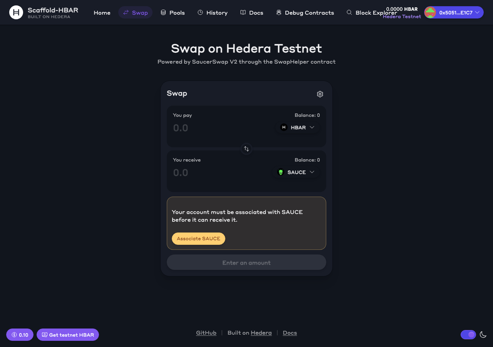
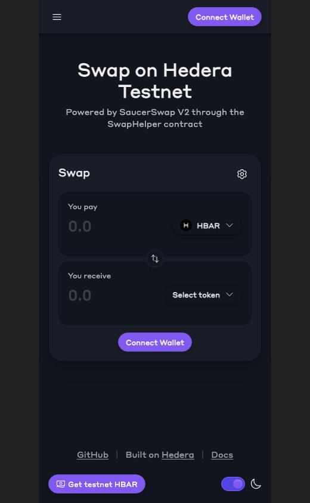

# Components and hooks

Everything lives under `packages/nextjs`. Components are in `components/swap/`, hooks in `hooks/swap/`, and pure logic in `utils/swap/`. Import from the index files:

```tsx
import { SwapWidget, TokenSelect } from "~~/components/swap";
import { useQuote, useSwap } from "~~/hooks/swap";
```

Amounts are always `bigint` in a token's smallest unit. For HBAR that is **tinybar** (8 decimals). Use `parseAmount` and `formatAmount` from `~~/utils/swap/math` to convert to and from user text.





More screenshots are in `docs/images/` (`pools-mobile.png`, `docs-mobile.png`, `home-mobile.png`).

## The quick way: `SwapWidget`

```tsx
"use client";
import { SwapWidget } from "~~/components/swap";

export default function Page() {
  return <SwapWidget />;
}
```

`SwapWidget` works with no props. It composes every part below, reads the wallet's network, quotes through QuoterV2, checks association, and swaps through the deployed `SwapHelper`. All props are optional:

| Prop | Type | Notes |
| --- | --- | --- |
| `title` | `string` | Heading of the card. Default "Swap". |
| `defaultTokenOut` | `string` | Token to receive when the list loads: a Hedera id (`0.0.1183558`) or a symbol. |
| `lockTokenOut` | `boolean` | Hides the output picker, for a fixed target such as a checkout. |
| `recipient` | `0x…` | Sends the output to this account instead of the wallet. The widget checks that the account is associated. |
| `buttonLabel` | `string` | Label of the main button. Default "Swap". |

```tsx
// A checkout: the buyer pays in any token, the shop receives SAUCE.
<SwapWidget title="Pay" defaultTokenOut="0.0.1183558" lockTokenOut recipient={shop} buttonLabel="Pay" />
```

It needs a wallet provider (the scaffold's layout already has one) and `SwapHelper` deployed on the active network, otherwise it shows a notice.

To change its layout, copy `SwapWidget.tsx` into your app and rearrange the parts. It is about 200 lines.

## Components

### `TokenSelect`

A button that opens a searchable list of tokens with icon, symbol and balance.

| Prop | Type | Notes |
| --- | --- | --- |
| `tokens` | `SwapToken[]` | The list to pick from. Usually from `useTokenList`. |
| `value` | `SwapToken` | The selected token. |
| `onChange` | `(token: SwapToken) => void` | Called when the user picks one. |
| `balanceOf` | `(token) => bigint \| undefined` | Optional. Shows a balance next to each token. |
| `disabledToken` | `SwapToken` | Optional. Greys out a token, such as the one chosen on the other side. |

`TokenIcon` is exported from the same file: `<TokenIcon token={token} size={24} />`.

```tsx
const { tokens } = useTokenList();
const { balanceOf } = useTokenBalances();
<TokenSelect tokens={tokens} value={token} onChange={setToken} balanceOf={balanceOf} />;
```

### `AmountInput`

An amount field with balance, MAX button and USD value.

| Prop | Type | Notes |
| --- | --- | --- |
| `label` | `string` | For example "You pay". |
| `value` | `string` | The text in the field. |
| `onChange` | `(value: string) => void` | Omit with `readOnly` for an output field. |
| `token` | `SwapToken` | Used for the balance and USD value. |
| `balance` | `bigint` | The account's balance in the smallest unit. |
| `onMax` | `() => void` | Shows a MAX button. Omit for outputs. |
| `readOnly`, `loading` | `boolean` | |
| `tokenSelect` | `ReactNode` | Slot for a `TokenSelect`. |

### `SlippageSettings`

A collapsible panel for slippage presets (0.1%, 0.5%, 1%), a custom value and the deadline.

| Prop | Type | Notes |
| --- | --- | --- |
| `value` | `SwapSettings` | `{ slippageBps, deadlineMinutes }`. |
| `onChange` | `(settings) => void` | |

`DEFAULT_SETTINGS` is `{ slippageBps: 50, deadlineMinutes: 10 }`. Slippage is capped at 50%.

### `QuoteDetails`

Rate, minimum received, price impact, route and fees for a quote. Price impact turns into a warning when it is high.

| Prop | Type | Notes |
| --- | --- | --- |
| `quote` | `Quote` | From `useQuote`. |
| `tokenIn`, `tokenOut` | `SwapToken` | |
| `amountIn` | `bigint` | Gross amount the user pays. |
| `route` | `SwapRoute` | From `useRoute`. |
| `routeSymbols` | `string[]` | Symbols for `route.tokens`, in order. |
| `slippageBps` | `number` | |
| `feeBps` | `number` | The integrator fee, from `useSwapHelper`. Shown only when above zero. |

### `AssociateButton`

Renders nothing when the token needs no association. Otherwise it explains why and associates in one click.

| Prop | Type | Notes |
| --- | --- | --- |
| `token` | `SwapToken` | |
| `subject` | `"wallet" \| "helper"` | `"wallet"` for a token you swap **to**; `"helper"` for a token you swap **from**. |

```tsx
<AssociateButton token={tokenOut} subject="wallet" />
<AssociateButton token={tokenIn} subject="helper" />
```

### `TxStatus`

Pending, success and error states with a Hashscan link.

| Prop | Type | Notes |
| --- | --- | --- |
| `status` | `SwapStatus` | `"idle" \| "approving" \| "swapping" \| "confirming" \| "success" \| "error"`. Renders nothing when idle. |
| `hash` | `string` | Adds a "View on Hashscan" link. |
| `error` | `string` | Shown in the error state. |

### `SwapHistory`

The connected account's recent swaps through `SwapHelper`, from the mirror node. No props. Handles not connected, not deployed, loading, empty and error states.

### `PoolsTable`

SaucerSwap V2 pools with fee tier, reserves and TVL, sorted by TVL. Empty pools are hidden.

| Prop | Type | Default |
| --- | --- | --- |
| `limit` | `number` | `25` |

## Hooks

### `useSwap()`

Runs a swap: approves `SwapHelper` when the input is a token, sends the right entry point (HBAR in, token to token, or token to HBAR) and waits for the receipt.

```tsx
const { swap, reset, status, hash, error, isBusy } = useSwap();

await swap({
  tokenIn,
  tokenOut,
  route,
  amountIn,
  amountOutMinimum: applySlippage(quote.amountOut, 50),
  // optional:
  recipient: "0x…",        // defaults to the connected account
  deadlineSeconds: 600n,   // defaults to 10 minutes
});
```

`swap` resolves to the transaction hash, or `undefined` on failure (see `error`). It converts HBAR value to weibar for you.

### `useQuote(route, amountIn)`

Quotes through QuoterV2 and refreshes every 15 seconds. Returns a React Query result whose `data` is `{ amountOut, fee, priceImpact }`. `amountIn` is the gross amount the user pays; the hook removes the integrator fee before quoting. Price impact compares your trade against a 1% sized reference trade.

### `useRoute(tokenIn, tokenOut)`

The best route from live pool liquidity: a direct pool, otherwise two hops through WHBAR. Returns `{ route, isLoading }`. `route` is `{ tokens, fees }` or `undefined` when no pool has liquidity.

### `useTokenList()`

Returns `{ tokens, isLoading, error }`: native HBAR first, then every SaucerSwap token that has a V2 pool.

### `useTokenBalances()`

Balances of the connected account: HBAR from the wallet, HTS tokens from the mirror node (first 100). Returns `balanceOf(token)`, `refetch` and loading state.

### `useAssociation(token, subject)`

Returns `{ isAssociated, isLoading, isAssociating, error, associate }`. `isAssociated` is `true` for native HBAR and `undefined` while checking. Use `subject` as described for `AssociateButton`.

### `useSwapHistory(limit = 20)`

Recent swaps for the connected account from the mirror node's contract logs. Each record is `{ hash, timestamp, tokenIn, tokenOut, amountIn, amountOut, fee }`. `tokenIn` or `tokenOut` is the zero address for native HBAR.

### `usePools()`

All V2 pools for the current network plus the trimmed list the route finder uses.

### `useSwapHelper()`

`{ address, feeBps, isDeployed, isLoading }` for the deployed `SwapHelper` on the current network.

### `useSwapNetwork()`

The SaucerSwap, mirror node and Hashscan endpoints for the wallet's chain (or the target network when disconnected). See `utils/swap/config.ts`.

## Pure helpers

| Module | Exports |
| --- | --- |
| `utils/swap/math.ts` | `parseAmount`, `formatAmount`, `applySlippage`, `priceImpactPercent`, `splitFee`, `WEIBAR_PER_TINYBAR`, `BPS` |
| `utils/swap/route.ts` | `findRoute`, `encodePath`, `toSwapPools` |
| `utils/swap/tokens.ts` | `HBAR`, `buildTokenList`, `fromApiToken`, `pathId` |
| `utils/swap/config.ts` | `getSwapNetwork`, `idToEvmAddress`, `hashscanTx` |

These are covered by the tests in `utils/swap/swap.test.ts`.

## Build your own widget

```tsx
"use client";
import { useState } from "react";
import { HBAR } from "~~/utils/swap/tokens";
import { applySlippage, parseAmount } from "~~/utils/swap/math";
import { useQuote, useRoute, useSwap, useTokenList } from "~~/hooks/swap";

export function MiniSwap() {
  const { tokens } = useTokenList();
  const out = tokens.find(t => t.symbol === "SAUCE");
  const { route } = useRoute(HBAR, out);
  const amountIn = parseAmount("1", HBAR.decimals);
  const { data: quote } = useQuote(route, amountIn);
  const { swap, status } = useSwap();

  if (!out || !route || !quote || !amountIn) return null;
  return (
    <button
      className="btn btn-primary"
      disabled={status !== "idle"}
      onClick={() =>
        swap({ tokenIn: HBAR, tokenOut: out, route, amountIn, amountOutMinimum: applySlippage(quote.amountOut, 50) })
      }
    >
      Swap 1 HBAR for {out.symbol}
    </button>
  );
}
```

Remember the recipient must be associated with the output token first. Add `<AssociateButton token={out} subject="wallet" />`.

## Use-case components

In `components/use-cases/`. These are full flows built from the parts above.

| Component | What it does |
| --- | --- |
| `PaymentLinkBuilder` | Builds a `/pay` link from a receiver address, a token, and an optional shop name and order id. |
| `DcaForm` | Starts an auto-buy: token, HBAR per run, interval, runs, with the cost breakdown. Calls `ScheduledSwap.create`. |
| `DcaPlans` | The connected account's auto-buy plans with progress, a Hashscan link to the next run, Cancel and Resume. |
| `PayoutsForm` | Paste payouts, see the check for every row, and send them with one signature through `BatchPayout`. |

Their hooks are `useScheduledSwap`, `useDcaPlans`, `useBatchPayout` and `usePayoutChecks` in `hooks/swap/`.
